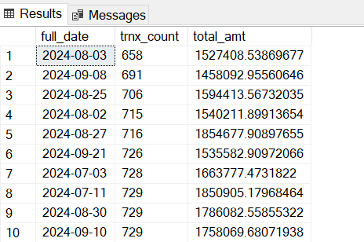
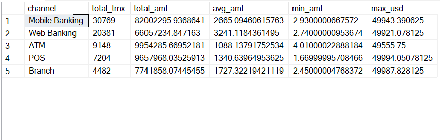
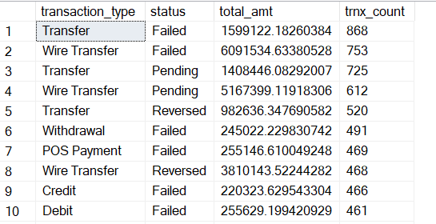
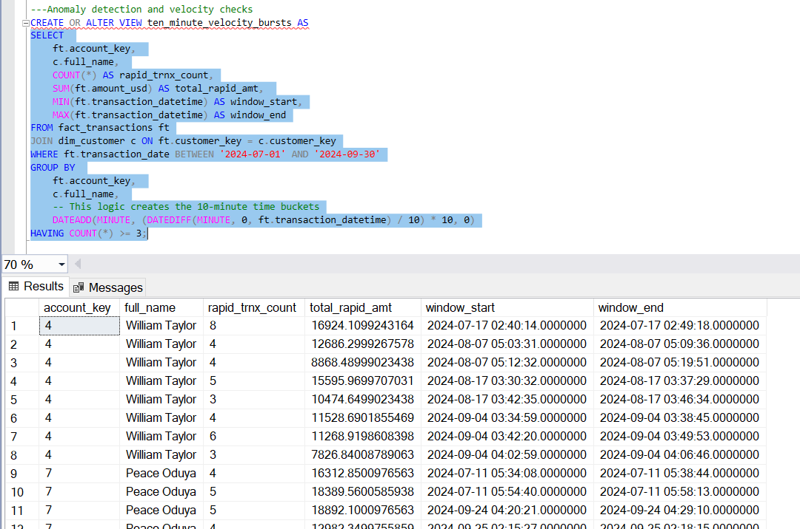
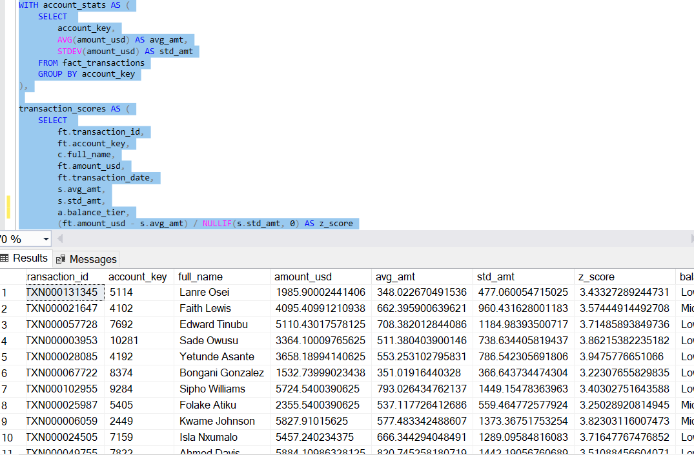
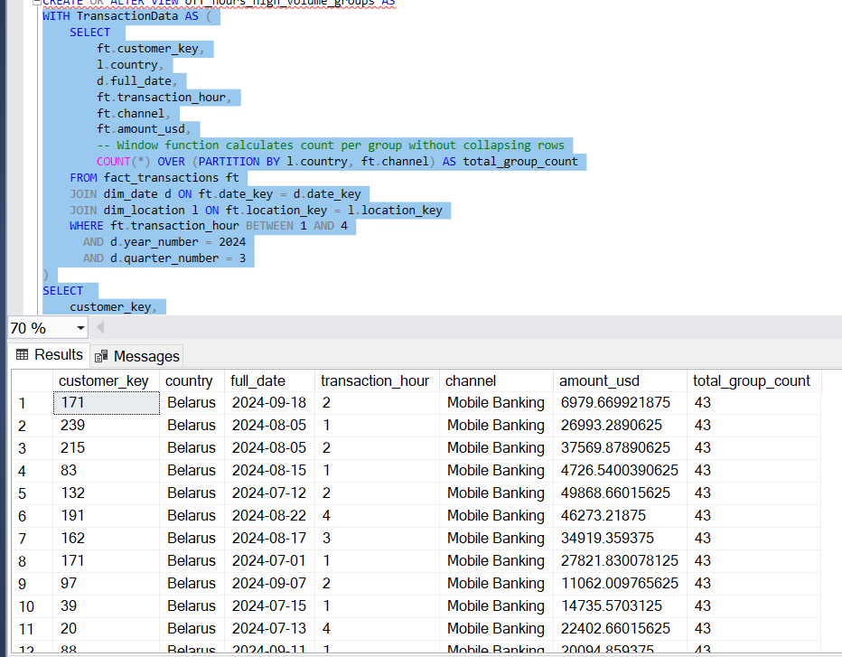
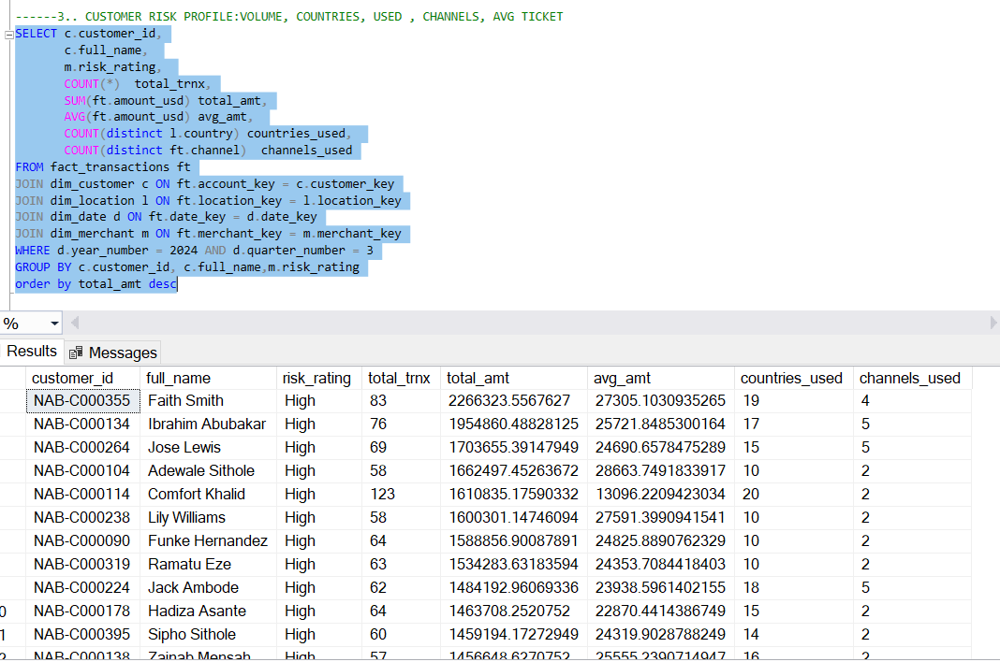
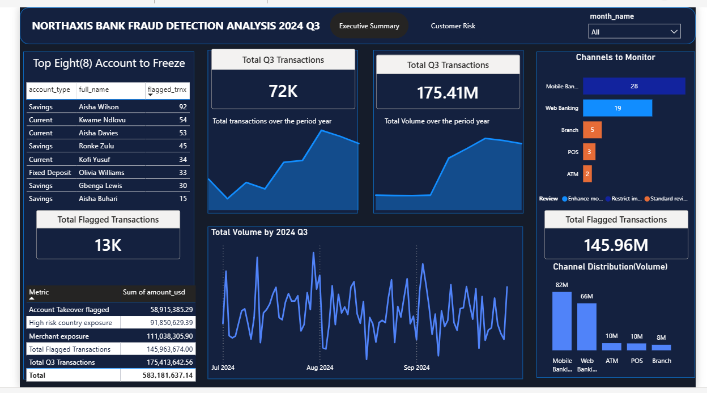

# NorthAxis-Bank---Fraud-intelligence-Investigation
### SQL based risk analysis of suspicious $2.3M outflows | Q3 2024

----

## Project Background
NorthAxis Bank's compliance hotline recorded a 340% spike in fraud related complaints in Q3 2024. 
Internal audit flagged an estimated $2.3M  in suspicious outflows concentrated in a 6 week window. 
As a Junior Data analyst on Risk intelligence team, I was tasked with investigating transaction patterns, profiling
high-risk accounts and delivering a data backed risk report to the executive team ahead of board risk committe meeting.

----

## Tools used
- SQL server
- Power BI (Visualization)
- Github (Documentation)
- Link to visualization page: [visualization](https://app.fabric.microsoft.com/groups/me/reports/5d91a66d-be9c-48ea-a494-59299f30ea5f/3a5329acab1835a2d409?experience=fabric-developer) 

-----

## Data model
The analysis was conducted on a gold layer data warehouse with a star schema consisting of 6 tables:

| Table | Description |
| ---   | ---- |
| fact_transactions | Core transaction ledger - amounts, channels, fraud flags |
| dim_customer | Customer profiles, KYC status, fraud target flag | 
| dim account | Account types, balance tiers, credit limits | 
| dim_merchant | merchant details, shell merchant flag, risk rating |
| dim_location | Geographical data, high risk country flag |
| dim_date | Calendar table with weekend and month end flags |

----

## Analytical deliverables

### 1. Transaction overview & Baseline KPIs
Established what normal looks like before hunting anomalies 
Volume, value, channel breakdown and daily trend across Q3 2024

Key findings: 
With 30,769 transactions, Mobile Banking accounts for the highest volume of activity, signaling a strong user preference for on-the-go accessibility.
Although Web Banking has lower volume than Mobile, it maintains a significantly higher Average Transaction Value ($3,241). This suggests that customers prefer the web interface for larger, more complex financial movements. Most failed transactions occured during transaction with over 800 transactions while the least transaction that happened with POS payment and it was reversed with 292 transactions. 

| Metrics | Top performer | Insights | 
| ------ | ------ | ------- |
| highest Volume | Mobile banking | 30.7K TRNX|
| Highest avg spend | Web | $3,241/TRNX |
| Highest Daily revenue | 2024-08-27 | $1.52M | 

### 2. Anomaly detection & Velocity checks 
Flagged rapid repeat transactions, off hours spikes and statistical outliers using z score analysis. 

A significant portion of the flags are concentrated on two specific accounts: William Taylor (Account 4) and Peace Oduya (Account 7).
Many of these bursts occur in under 5 minutes. For example, Account 7 completed 4 transactions in approximately 4 minutes (05:34 to 05:38). This level of speed is often a primary indicator fraud or theft. 

Technical Note: I used a floor-division logic on the transaction timestamp to create discrete 10-minute windows, allowing for efficient grouping without the performance overhead of complex self-joins.

--- off hours spikes and statistical outlier
 I calculated the Mean ($\mu$) and Standard Deviation ($\sigma$) for every account. The Z-Score formula $(x - \mu) / \sigma$ measures how many standard deviations a specific transaction is from the average.
Key Finding: Every transaction shown in the results has a Z-Score > 3.0. In statistics, any value over 3.0 is considered a high-intensity outlier.Case Study: Customer Lanre Osei (Account 5114) has an average transaction of $348, but triggered an alert with a $1,985 transaction (Z-Score of 3.43). This represents a nearly 600% increase over his typical behavior, a possible classic red flag for card theft.

We see multiple different customer_key values (171, 239, 215, etc.) all transacting from the same country during the same "dead of night" hours. This strongly suggests a  compromised mobile gateway rather than independent, legitimate user activity.

### 3. Customer risk profiling 
Built behavioral baselines per customer and surfaced daviations from thheir own transactions history

- Top-tier customers like Faith Smith and Comfort Khalid are transacting in 19 to 20 different countries within a single quarter. In AML (Anti-Money Laundering) terms, such high "Jurisdictional Velocity" is a primary red flag for layered money movement.
- Massive Capital Concentration: The top 10 customers identified are each responsible for $1.4M to $2.2M in transactions over just three months.

### 4. Executive risk report
Board ready summary of estimated exposure, top accounts recommended for freezing, channels to restrict and merchants to blacklist. 

This project involved a comprehensive audit of over 71,000 transactions in Q3 2024 to identify operational trends and mitigate financial crime. By deploying advanced SQL analytics, I identified significant vectors of fraud and quantified the bank's total risk exposure.

1. High-Level Performance & Exposure
Total Volume: The system processed 71,984 transactions totaling $175.4M.

System Flagging Rate: Approximately 18.3% of transactions (13,175) were flagged by internal rules, involving $14.5M in at-risk capital.

Merchant & Country Risk: A significant portion of the risk is concentrated in specific areas, with $11.1M linked to high-exposure merchants and $9.1M originating from high-risk jurisdictions.

Account Takeover (ATO) Specifics: I isolated 2,240 transactions ($5.8M) specifically showing patterns consistent with ATO behavior (rapid-fire bursts and credential testing).

### Key findings summary
| Customer name | Total amount Q3 | Countries Visited | Risk priority |
| ---- | ---- | ---- | ---- | 
| Faith Smith | $2.26M | 19 | Immediate Audit | 
| Comfort Khalid | $1.6M | 20 | Immediate Audit | 

-----

| Analysis Type | Detection method | Risk identified | 
| ---- | ---- | ---- |
| Statistical | z score outlier | Individual spike didnt match history|
| Temporal | Off hours monitoring | Burst of activity during midnights |

----
Visualization
 

## Recommendations
- Increase the "Risk Weight" for all off-hour mobile transactions originating from high-risk regions identified in the geographic clustering.
- Real-Time Alerts: Automated SMS "Did you perform this transaction?" messages should be triggered for any 1 AM - 4 AM activity exceeding $1,000.
- Optimize Mobile UX: Given the high volume, any small friction in the Mobile Banking app has a massive impact on the majority of the user base.
